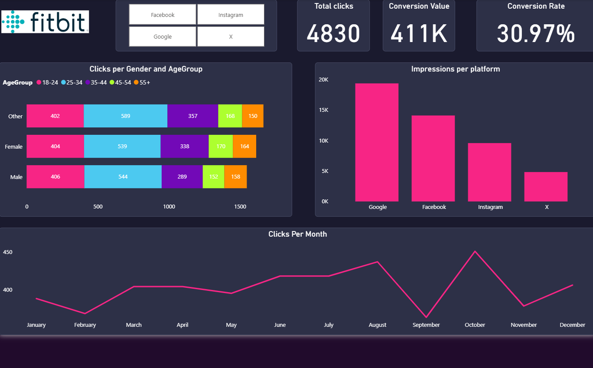
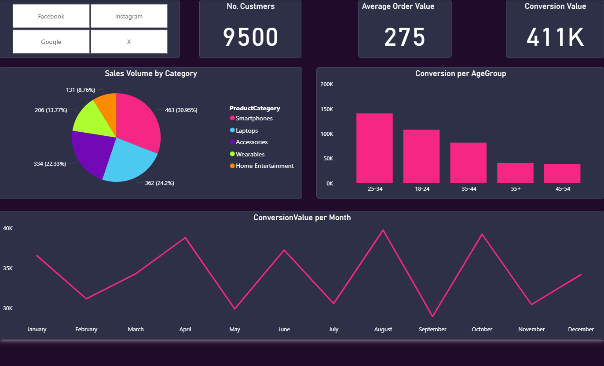
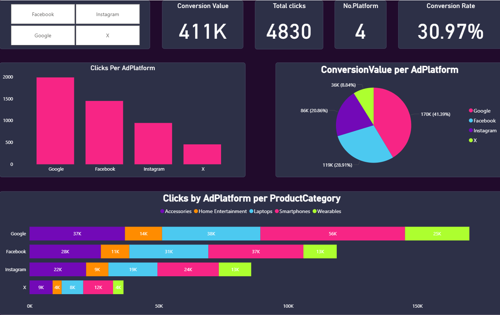

# Digital Marketing Campaign Performance Dashboard

A Power BI dashboard built for **Fitbit** (mockup), tracking cross-channel digital marketing performance across **$411K+ in conversion value** from 9,500 customers — designed to optimize ad spend, identify high-performing platforms, and eliminate budget waste.

[Watch the Video Walkthrough Here](link)

---

## Business Problem & Objective

Marketing teams running multi-platform campaigns across Google, Facebook, Instagram, and X face a fragmented view of performance — making it difficult to attribute conversions accurately or reallocate budget from underperforming channels.

**Objective:** Centralize cross-channel campaign data into a single decision-support dashboard that enables the marketing team to:
- Identify which platforms and demographics drive the highest conversion value
- Optimize ad spend allocation based on ROI per channel
- Retarget the most profitable audience segments by age and gender

---

## Key Metrics & KPIs

| KPI | Value |
|---|---|
| Total Conversion Value | $411K+ |
| Conversion Rate | 30.97% |
| Total Clicks | 4,830 |
| Total Customers | 9,500 |
| Average Order Value | $275 |
| Platforms Tracked | Google, Facebook, Instagram, X |

---

## Dashboard Structure & Views

### View 1 — Impressions
Tracks click distribution by gender and age group, impressions per platform, and monthly click volume trends to assess reach and audience engagement.



### View 2 — Conversion Value
Tracks sales volume broken down by product category (Smartphones, Laptops, Accessories, Wearables, Home Entertainment), conversions per age group, and monthly conversion trends to identify peak demand periods.



### View 3 — Platform Efficiency
Analyzes clicks vs. conversion value per platform and per product category to surface which channels generate traffic with actual purchase intent vs. which consume budget without return.



---

## Technical Stack & Process

**Tools:** Power BI · Power Query · DAX

### Data Modeling (Multi-Source Integration)
- Unified ad performance data from multiple platforms (Google, Facebook, Instagram, X) into a single normalized data model
- Resolved schema inconsistencies across sources (column naming, date formats, metric definitions)
- Built relationships between campaign, demographic, and product category tables for cross-filtering

### DAX Measures
- Conversion Rate = `Total Conversions / Total Clicks`
- Conversion Value per Platform
- Click-to-Conversion Ratio by Age Group & Gender
- Monthly and cumulative trend aggregations

---

## Repository Contents

```
├── /screenshots           # Dashboard screenshots
├── dashboard.pbix         # Power BI project file
└── README.md
```